# Wi-Fi Direct Setup for Raspberry Pi Data Transfer

## Overview

This document provides step-by-step instructions to setup and use Wi-Fi Direct on the Raspberry Pi Zero to transfer sensor data that was recorded on the Raspberry Pi to your PC using the IPR Dashboard software.

## Platform Requirements

- **Hardware:** Raspberry Pi Zero 2W
- **Operating System:** Raspberry Pi OS (64-bit recommended)
- **Software:** IPR Dashboard software v2.0 or greater
- **PC Software:** Putty SSH (or any other built-in Windows 10+, macOS, Linux tools)
- **Optional:** WinSCP (Windows) or similar SFTP client for file management

## Estimated Time

- Initial Setup: 45-60 minutes
- Testing and Verification: 15 minutes
- **Total:** ~75 minutes

## Table of Contents

1. [Preparing the Raspberry Pi](#1-preparing-the-raspberry-pi-20-minutes)
2. [Enabling Wi-Fi Direct (P2P) on Raspberry Pi](#2-enabling-wi-fi-direct-p2p-on-raspberry-pi-15-minutes)
3. [Setting up the Python Logging Script](#3-setting-up-the-python-logging-script-15-minutes)
4. [Accessing the Raspberry Pi from Your IPR Dashboard Software](#4-accessing-the-raspberry-pi-from-your-ipr-dashboard-software)
5. [Troubleshooting](#troubleshooting)
6. [Quick Reference](#quick-reference)

---

## 1. Preparing the Raspberry Pi (20 minutes)

### 1.1 Install Raspberry Pi OS

1. Download the Raspberry Pi Imager from: https://www.raspberrypi.com/software/operating-systems/

2. Launch the Imager and configure:
   - **Device:** Select "Raspberry Pi Zero 2 W"
   - **OS:** Select "Raspberry Pi OS (64-bit)" or "Raspberry Pi OS Lite (64-bit)" if you don't need a desktop interface
   - **Storage:** Select your microSD card

   <p align="center">
   
   </p>
   <p align="center"><i>Select Raspberry Pi Zero 2 W from the list</i></p>

   <p align="center">
   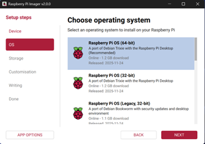
   </p>
   <p align="center"><i>Select the Raspberry Pi OS, it can be the Lite version if no desktop is needed</i></p>

3. Click the Settings gear icon (or press `Ctrl+Shift+X`) to configure OS customization

### 1.2 Configure OS Settings (IMPORTANT)

Configure the following settings in the Imager:

#### Hostname
- Set to: `IPR-sensor`
- This allows you to access the Pi at `IPR-sensor.local` on the same Wi-Fi network

<p align="center">
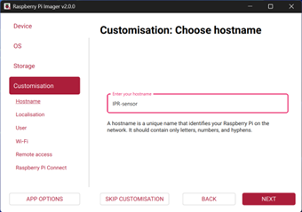
</p>
<p align="center"><i>Create a device hostname</i></p>

#### Username and Password (REQUIRED)
- **Username:** `ipr-sensor`
- **Password:** `ipr-sensor`
- **Note:** These credentials will be used for SSH access throughout this guide

<p align="center">
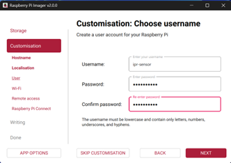
</p>
<p align="center"><i>Setup the username and password for the main user. This will be used for SSH communication later</i></p>

#### Enable SSH (REQUIRED)
- Enable "Use password authentication"

<p align="center">
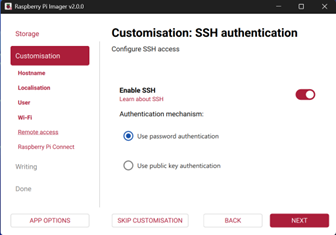
</p>
<p align="center"><i>Enable SSH communication with the Raspberry Pi</i></p>

#### Wi-Fi Configuration (TEMPORARY - Optional)
- Configure your local Wi-Fi network credentials
- This is only needed if you don't have a monitor/keyboard for the Pi
- **Note:** This Wi-Fi connection will be replaced by Wi-Fi Direct in Step 2

#### Locale Settings
- Set your timezone and keyboard layout

<p align="center">
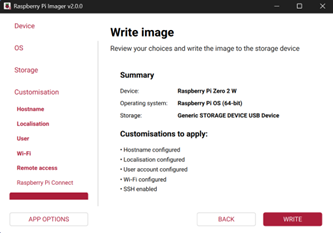
</p>
<p align="center"><i>Summary of the installation</i></p>

4. Click **Save**, then click **Write** to flash the OS to the SD card

5. Once complete, safely eject the SD card

### 1.3 Initial Boot and System Update

1. Insert the SD card into your Raspberry Pi and power it on

2. Wait 2-3 minutes for the first boot to complete

3. Connect to the Pi via SSH:
   - If you configured Wi-Fi: `ssh ipr-sensor@ipr-sensor.local` or use the Pi's IP address with port 22
   - If using direct connection: Connect monitor and keyboard

4. Update the system:
   ```bash
   sudo apt update && sudo apt upgrade -y
   ```

5. Install required packages:
   ```bash
   sudo apt install python3 python3-pip python3-venv git -y
   ```

6. Reboot to ensure all updates take effect:
   ```bash
   sudo reboot
   ```

---

## 2. Enabling Wi-Fi Direct (P2P) on Raspberry Pi (15 minutes)

Wi-Fi Direct will turn your Raspberry Pi into a Wi-Fi access point, allowing direct connection without a router.

### 2.1 Create the Wi-Fi Hotspot

1. SSH into the Raspberry Pi (if not already connected)

2. Run the following command to create a Wi-Fi hotspot:
   ```bash
   # Create a hotspot
   sudo nmcli device wifi hotspot ssid "PiDirect" password "ipr-sensor"
   ```

#### Configuration Notes
- **SSID:** "PiDirect" (you can change this to any name you prefer)
- **Password:** "ipr-sensor" (you can change this to any password)
- **Pi IP Address:** The Raspberry Pi will always be accessible at `10.42.0.1`

> **IMPORTANT:** Your current SSH session will disconnect because the Pi is no longer connected to your router

### 2.2 Connect to the Wi-Fi Direct Network

1. On your PC, scan for Wi-Fi networks

2. Look for the network named "PiDirect" (or the SSID you chose)

3. Connect using the password "ipr-sensor" (or your chosen password)

4. Once connected, you'll be on a direct network with the Pi

> **Note:** You will NOT have internet access while connected to the Pi's hotspot. The Pi will always be at IP address: `10.42.0.1`

<p align="center">
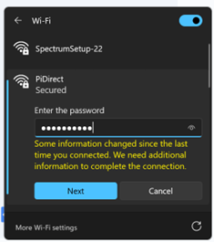
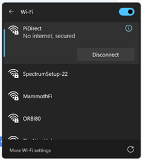
</p>
<p align="center"><i>Connect to the PiDirect network from your PC</i></p>

### 2.3 Configure Auto-Start on Boot

1. Establish a new SSH connection to the Pi:
   ```bash
   ssh ipr-sensor@10.42.0.1
   ```

2. Configure the hotspot to start automatically on boot:
   ```bash
   # Set auto-connect
   sudo nmcli connection modify Hotspot connection.autoconnect yes
   
   # Set priority to ensure it starts
   sudo nmcli connection modify Hotspot connection.autoconnect-priority 10
   
   # To check the status if active
   nmcli connection show --active
   ```

   **Expected Output:** You should see "Hotspot" listed as an active connection

3. Test the configuration by rebooting:
   ```bash
   sudo reboot
   ```

4. Wait 1-2 minutes, then verify:
   - The "PiDirect" network appears in your Wi-Fi list
   - You can reconnect and SSH to `10.42.0.1`

---

## 3. Setting up the Python Logging Script (15 minutes)

### 3.1 Connect to the Raspberry Pi

### 3.2 Install WinSCP on the remote Windows PC (recommended)

Download from: https://winscp.net/eng/download.php

### 3.3 Connect to the Wi-Fi Direct and login with the user

Configure WinSCP connection:
- **Host name:** `10.42.0.1`
- **Port:** `22`
- **Username:** `ipr-sensor`
- **Password:** `ipr-sensor`

<p align="center">
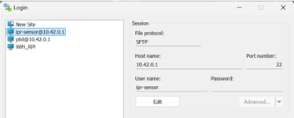
</p>
<p align="center"><i>WinSCP connection settings</i></p>

### 3.4 Get the latest Python script from GitHub

Repository: https://github.com/phil-engineering/IPR_Wireless_Data_Logger.git

### 3.5 Copy all the Python scripts to the Raspberry Pi

Copy to location: `/home/ipr-sensor/Documents/*`

### 3.6 Test the script

1. Make sure the sensor is connected to the Raspberry Pi, and powered ON. Then, run the following commands to launch the script:

   ```bash
   # Go to the folder where the python script is located
   cd Documents
   
   # Run the Python script
   python ipr_sensor.py
   ```

2. Make sure it logs sensor data correctly. This will start the recording locally on the RPi with a new BIN file for each 150 MB of data.

   <p align="center">
   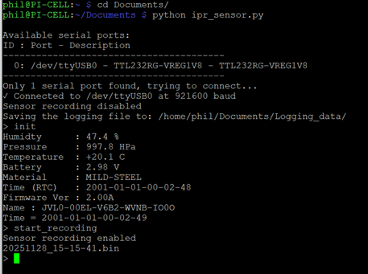
   </p>
   <p align="center"><i>Python script running and logging sensor data</i></p>

   <p align="center">
   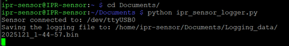
   </p>
   <p align="center"><i>Binary data files being created</i></p>

---

## 4. Accessing the Raspberry Pi from Your IPR Dashboard Software

### 4.1 Copy sensor data files to your PC

1. Connect to the Raspberry Pi using WinSCP (see Step 3.3)

2. Navigate to `/home/ipr-sensor/Documents/`

3. Copy `*.bin` files to your local PC

### 4.2 View the data in IPR Dashboard

To view the data, select "**Data -> Load from local file...**" and choose the `*.bin` file that was saved in step 4.1

<p align="center">
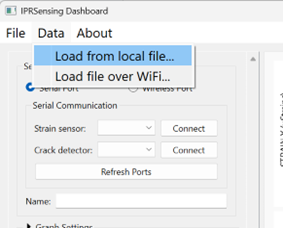
</p>
<p align="center"><i>Loading sensor data in the IPR Dashboard software</i></p>

---

## Troubleshooting

### Wi-Fi Direct Issues

**Problem:** Can't see the "PiDirect" network
- **Solution:** Wait 2-3 minutes after boot for the hotspot to start
- **Solution:** Check if the service is running: `systemctl status NetworkManager`
- **Solution:** Manually restart the hotspot: `sudo nmcli connection up Hotspot`

**Problem:** Can connect to Wi-Fi but can't SSH
- **Solution:** Verify the Pi's IP is `10.42.0.1`
- **Solution:** Check SSH service: `sudo systemctl status ssh`
- **Solution:** Try pinging the Pi first: `ping 10.42.0.1`

### Python Logger Issues

**Problem:** No ".bin" files are created
- **Solution:** Check sensor connections
- **Solution:** Verify sensor is powered on
- **Solution:** Check script has write permissions: `ls -la ~/Documents/`

### General Issues

**Problem:** Lost connection to the Pi
- **Solution:** Reconnect to the "PiDirect" Wi-Fi network
- **Solution:** Reboot the Pi and wait 2-3 minutes
- **Solution:** Check if your PC's Wi-Fi is enabled

---

## Quick Reference

### SSH Connection
```bash
ssh ipr-sensor@10.42.0.1
```

### Default Credentials
- **Username:** `ipr-sensor`
- **Password:** `ipr-sensor`
- **Raspberry Pi IP Address:** `10.42.0.1`
- **Wi-Fi SSID:** `PiDirect`
- **Wi-Fi Password:** `ipr-sensor`