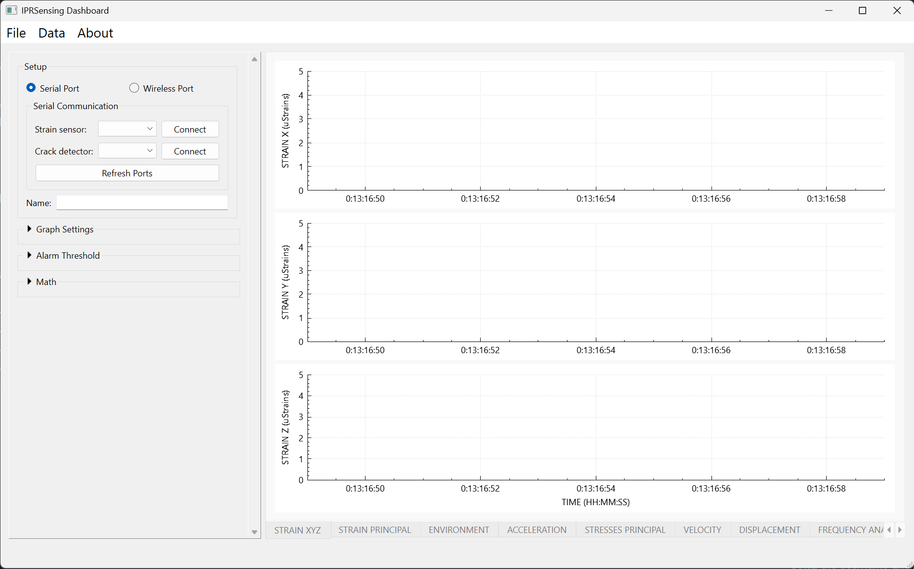
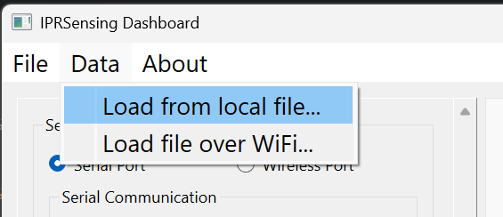
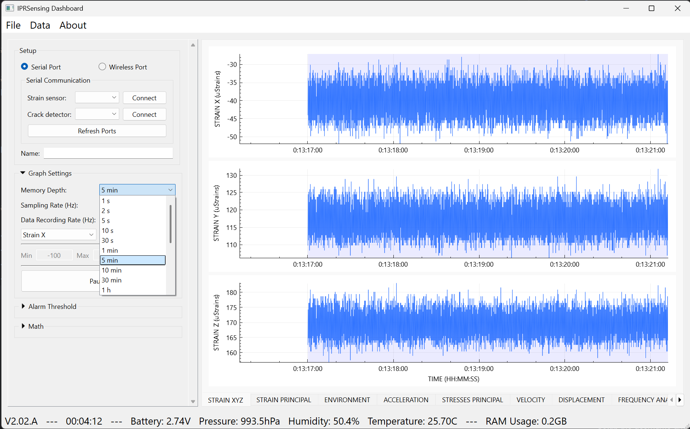
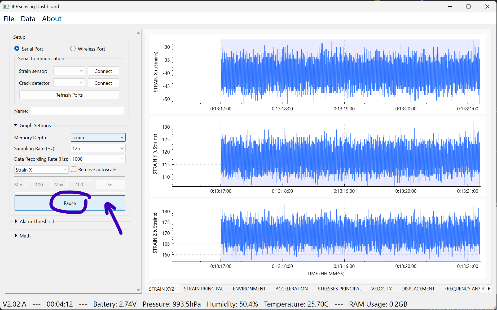
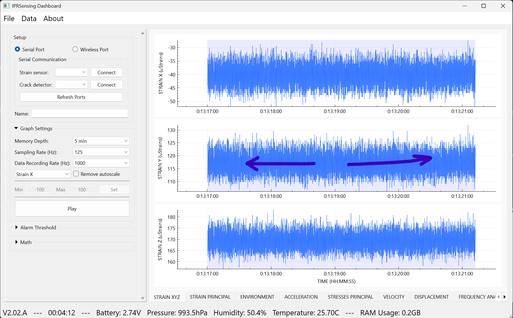

# IPR Dashboard - Data Import Guide

## Overview

This guide explains how to import and visualize sensor data from your Raspberry Pi into the IPR Dashboard software on Windows. The IPR Dashboard allows you to view real-time strain data, configure display settings, and analyze recorded measurements.

## Table of Contents
1. [Getting Started](#getting-started)
2. [Importing Data](#importing-data)
3. [Understanding the Dashboard](#understanding-the-dashboard)
4. [Working with Data](#working-with-data)
5. [Graph Settings and Configuration](#graph-settings-and-configuration)
6. [Data Navigation](#data-navigation)
7. [Troubleshooting](#troubleshooting)

---

## Getting Started

### Prerequisites

Before importing data, ensure you have:
- Completed the Raspberry Pi setup (see [Installation Manual](INSTALLATION_MANUAL.md))
- IPR Dashboard software installed on your Windows PC
- Transferred .bin files from your Raspberry Pi to your PC (using WinSCP as described in the installation guide)

### Software Requirements
- **IPR Dashboard:** Version 2.0 or greater
- **Operating System:** Windows 10 or later
- **Data Files:** .bin format files from the Raspberry Pi sensor

---

## Importing Data

### Step 1: Launch IPR Dashboard

Open the IPR Dashboard application on your Windows PC. You'll see the main interface with the setup panel on the left and empty graph areas on the right.

<i>IPR Dashboard main window on startup</i>

The main window shows:
- **Setup Panel (Left):** Contains connection options, communication settings, and configuration controls
- **Graph Area (Right):** Displays three strain channels (X, Y, Z) once data is loaded
- **Menu Bar:** Provides access to File, Data, and About options

### Step 2: Access the Data Menu

To import previously recorded data from your Raspberry Pi:

1. Click on **"Data"** in the menu bar at the top
2. You'll see two options:
   - **Load from local file...** - For importing .bin files already transferred to your PC
   - **Load file over WiFi...** - For direct transfer over the Pi's hotspot (requires active connection). **Feature not available for now.**

<i>Select "Load from local file..." to import .bin files from your PC</i>

### Step 3: Select Your Data File

1. Click **"Load from local file..."**
2. Navigate to the folder where you saved your .bin files (transferred via WinSCP)
3. Select the desired .bin file
4. Click **"Open"**

The dashboard will load the data and begin displaying it in the three graph panels.

---

## Understanding the Dashboard

### Main Display Components

Once data is loaded, the dashboard displays real-time or recorded sensor measurements:

<i>Dashboard displaying imported strain data across three channels (X, Y, Z)</i>

**Graph Panels:**
- **STRAIN X, Y, Z (µStrain):** Three synchronized graphs showing strain measurements
- **Time Axis:** Displays timestamps in HH:MM:SS format
- **Value Axis:** Shows strain values in microstrains (µStrain)

**Status Bar (Bottom):**
- **Version:** Software version (V2.0.2.A)
- **Battery:** Sensor battery voltage
- **Pressure:** Environmental pressure reading
- **Humidity:** Ambient humidity percentage
- **Temperature:** Current temperature in °C
- **RAM Usage:** System memory consumption

**Bottom Tabs:**
Additional data views are available:
- STRAIN XYZ
- STRAIN PRINCIPAL
- ENVIRONMENT
- ACCELERATION
- STRESSES PRINCIPAL
- VELOCITY
- DISPLACEMENT
- FREQUENCY ANALYSIS

---

## Working with Data

### Graph Settings

The left panel provides extensive control over how data is displayed:

<i>Memory Depth dropdown showing time window options</i>

**Available Settings:**

1. **Memory Depth:** Controls the time window displayed on graphs
   - Options: 1s, 2s, 5s, 10s, 30s, 1 min, 5 min, 10 min, 30 min, 1 h
   - Default: 5 min
   - Use shorter windows for detailed analysis, longer for trend observation

2. **Sampling Rate (Hz):** Display refresh rate
   - Default: 125 Hz
   - Adjust based on your recording settings

3. **Data Recording Rate (Hz):** Original recording frequency
   - Default: 1000 Hz
   - Should match your Raspberry Pi recording configuration

4. **Strain Selection:** Choose which strain component to display
   - Options: Strain X, Strain Y, Strain Z, or combinations

5. **Remove Autoscale:** Checkbox to disable automatic Y-axis scaling
   - Enables manual Min/Max value setting

6. **Min/Max Values:** Set custom Y-axis range when autoscale is disabled
   - Default: -100 to 100

---

## Data Navigation

### Pausing and Reviewing Data

When viewing recorded data, you can pause playback to examine specific sections:

<i>Click the "Pause" button to stop data playback</i>

**Pause Feature:**
- Click **"Pause"** to freeze the current view
- Useful for analyzing specific events or patterns
- Data continues to be available; you're just pausing the display

### Navigating Through Data

Once paused, you can navigate through your recorded data:

<i>Use the middle graph to navigate through your data by clicking and dragging</i>

**Navigation Tips:**
- **Click and drag** on any graph to pan through the data timeline
- Use the **arrows** shown in the image to understand drag direction
- The time axis updates as you navigate
- All three graphs remain synchronized during navigation
- Use shorter Memory Depth settings for more precise navigation

---

## Graph Settings and Configuration

### Additional Controls

**Alarm Threshold** (Expandable Section)
- Set threshold values to trigger alerts when strain exceeds limits
- Useful for monitoring structural health in real-time

**Math** (Expandable Section)
- Perform mathematical operations on strain data
- Calculate derived values like principal stresses

### Setup Options

**Serial Communication vs Wireless:**
- **Serial Port:** Direct USB connection (not applicable for imported files)
- **Wireless Port:** For live data streaming from Raspberry Pi over Wi-Fi Direct

When working with imported .bin files, the connection settings are not active since you're viewing pre-recorded data.

---

## Troubleshooting

### Common Issues

**Problem:** No graphs appear after loading a .bin file
- **Solution:** Verify the .bin file is not corrupted
- **Solution:** Check that the file was properly transferred from the Raspberry Pi
- **Solution:** Ensure you're using IPR Dashboard v2.0 or greater

**Problem:** Graphs are empty or show flat lines
- **Solution:** Check if the sensor was properly connected during recording
- **Solution:** Verify the Python script was running correctly on the Raspberry Pi
- **Solution:** Try adjusting the Memory Depth to view different time windows

**Problem:** Dashboard is slow or unresponsive
- **Solution:** Reduce the Memory Depth to a shorter time window
- **Solution:** Close other applications to free up RAM
- **Solution:** Check the RAM Usage indicator in the status bar

**Problem:** Can't find my .bin files
- **Solution:** Remember to transfer files from `/home/ipr-sensor/Documents/` on the Pi using WinSCP
- **Solution:** Check your Downloads folder or the last location you selected in WinSCP

**Problem:** Time axis shows incorrect timestamps
- **Solution:** Verify the Raspberry Pi's system time was set correctly during recording
- **Solution:** Check if timezone settings match between Pi and Windows PC

### Data Quality Issues

**Noisy Data:**
- Ensure sensor connections were secure during recording
- Check sensor power supply voltage (shown in status bar)
- Verify environmental conditions were stable

**Missing Data Sections:**
- Check if the Raspberry Pi lost power during recording
- Verify SD card had sufficient space
- Review system logs on the Raspberry Pi

---

## Best Practices

### For Data Recording
1. Always verify the sensor is connected before starting the Python script
2. Monitor battery voltage during extended recordings
3. Use appropriate sampling rates for your application
4. Allow the sensor to stabilize before recording critical data

### For Data Analysis
1. Start with a longer Memory Depth (5-10 min) to get an overview
2. Pause and zoom in on interesting features
3. Use the Remove Autoscale feature for comparing multiple datasets
4. Export or screenshot important findings for documentation

### File Management
1. Use descriptive names for your .bin files (include date/time)
2. Organize files by test or measurement session
3. Back up important data files regularly
4. Document environmental conditions during recording

---

## Additional Resources

- [Installation Manual](INSTALLATION_MANUAL.md) - Raspberry Pi setup and Wi-Fi Direct configuration
- [Python Logger Documentation](https://github.com/phil-engineering/IPR_Wireless_Data_Logger.git) - Recording script details

---

## Quick Reference

### Keyboard Shortcuts
- Check the **File** menu for any available shortcuts

### File Formats
- **Input:** .bin (binary sensor data from Raspberry Pi)
- **Size:** Each file contains up to 150 MB of data

### Typical Workflow
1. Record data on Raspberry Pi using Python script
2. Transfer .bin files to Windows PC via WinSCP
3. Launch IPR Dashboard
4. Load data via **Data → Load from local file...**
5. Adjust Memory Depth and other settings as needed
6. Pause and navigate to analyze specific sections
7. Review environmental data in status bar

---

**Document Version:** 1.0  
**Last Updated:** January 2026  
**Compatible with:** IPR Dashboard v2.0+